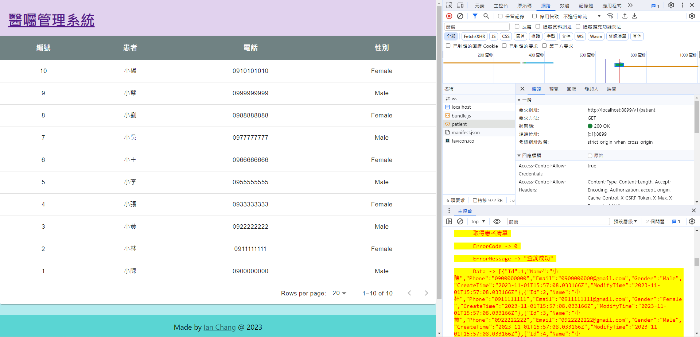
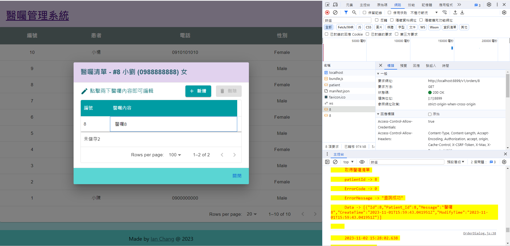

# Jubo - Frontend

## Environment

- Docker 24.0.2
- Node v18.15.0
- npm 9.5.0

## Initialize

```bash
# Run Init
$ npm uninstall -g create-react-app
$ npm install -g create-react-app
$ npx create-react-app jubo_frontend
$ npm run start
$ npm run test
$ npm run build
$ npm install --save @mui/material @emotion/react @emotion/styled @mui/icons-material axios
$ npm install --save react-router-dom
$ npm install --save validator
$ npm install --save dotenv
$ npm install --save moment
$ npm install --save lodash
# Build Local Image on Docker
$ docker build -t "jubofrontend:0.0.1" -t "jubofrontend:latest" .
# Run App on Docker
$ docker run -d --restart=always --name jubofrontend -p 8877:80 jubofrontend:latest
```

## Output

```bash
.
|   .env
|   .env.production
|   .gitignore
|   Dockerfile
|   nginx-jubo.conf
|   package.json
|   prettierrc.json
|   README.md
|   tree.txt
|   
+---public
|       favicon.ico
|       index.html
|       manifest.json
|       robots.txt
|       
+---snapshot
|       snapshot1.png
|       snapshot2.png
|       
\---src
    |   App.css
    |   App.js
    |   App.test.js
    |   index.css
    |   index.js
    |   reportWebVitals.js
    |   setupTests.js
    |   
    +---component
    |   +---Footer
    |   |       index.css
    |   |       index.js
    |   |       
    |   +---Header
    |   |       index.css
    |   |       index.js
    |   |       
    |   +---Main
    |   |       index.css
    |   |       index.js
    |   |       
    |   \---OrderDialog
    |           DialogContext.js
    |           index.js
    |           OrderDialog.js
    |           Toolbar.js
    |           ToolbarButton.js
    |           
    +---service
    |   +---Orders
    |   |       index.js
    |   |       
    |   \---Patient
    |           index.js
    |           
    +---util
    |       requestAsync.js
    |       sort.js
    |       
    \---view
            Patient.js
```

## Snapshot

### Patients



### Orders


